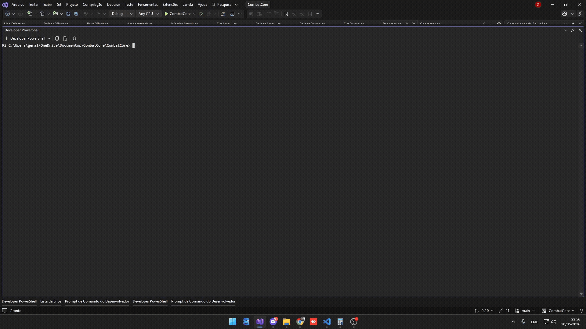

# ⚔️ CombatCore

Sistema de combate RPG em turnos desenvolvido em C# com foco em Programação Orientada a Objetos (POO), arquitetura de software e separação de responsabilidades.

---

## 📖 Sobre o projeto

O CombatCore começou como um projeto de treino em C# e evoluiu para uma estrutura modular de combate RPG baseada em turnos.

O objetivo principal do projeto é praticar conceitos fundamentais e intermediários de desenvolvimento backend utilizando C# e .NET, aplicando arquitetura escalável e código organizado.

Atualmente o projeto conta com:
- Sistema de combate em turnos
- Classes jogáveis
- Skills especiais
- Sistema de efeitos contínuos
- Separação entre ações, habilidades e efeitos
- Estrutura baseada em interfaces e herança

---

## ⚙️ Funcionalidades

### ⚔️ Sistema de combate
- Combate em turnos
- Ataques básicos
- Skills especiais
- Ataques críticos
- Chance de erro

### 🧙 Classes jogáveis
- Guerreiro
- Mago
- Arqueiro

Cada classe possui:
- Ataque básico próprio
- Skills exclusivas
- Regras específicas de combate

### 🧪 Sistema de efeitos
- Queimadura
- Veneno
- Atordoamento
- Cura

Os efeitos possuem:
- Duração por turnos
- Aplicação automática
- Remoção automática ao terminar

---

## 🎮 Demonstração



## 🧱 Arquitetura do projeto

O projeto foi organizado com foco em separação de responsabilidades.

### Interfaces
- `IAction` → ataques básicos
- `ISkill` → habilidades especiais
- `IEffect` → efeitos contínuos

### Herança
- `Character` é uma classe abstrata
- Classes jogáveis herdam de `Character`

### Organização
- Actions
- Skills
- Effects
- Classes
- Core do combate separado no `Program.cs`

---

## 🛠️ Tecnologias utilizadas

- C#
- .NET
- Console Application
- Git
- GitHub

---

## 📂 Estrutura do projeto

```bash
CombatCore/
│
├── Actions/
│   ├── IAction.cs
│   │
│   ├── ArcherActions/
│   ├── MageActions/
│   └── WarriorActions/
│
├── Effects/
│   ├── IEffect.cs
│   ├── BurnEffect.cs
│   ├── PoisonEffect.cs
│   ├── StunEffect.cs
│   └── HealEffect.cs
│
├── Skills/
│   ├── ISkill.cs
│   ├── FireSword.cs
│   ├── PoisonSword.cs
│   ├── StunSword.cs
│   └── ...
│
├── Classes/
│   ├── Warrior.cs
│   ├── Mage.cs
│   └── Archer.cs
│
├── Character.cs
├── Program.cs
├── CombatCore.csproj
└── README.md
```

---

## 🚀 Como executar

### Pré-requisitos
- .NET SDK instalado

### Clonando o projeto

```bash
git clone https://github.com/geraldimatheus/combat-core.git
```

### Executando

```bash
cd combat-core
dotnet run
```

---

## 📚 Conceitos praticados

- Programação Orientada a Objetos
- Encapsulamento
- Interfaces
- Polimorfismo
- Herança
- Classes abstratas
- Composição
- Listas Genéricas
- Arquitetura de software
- Separação de responsabilidades
- Organização de namespaces
- Estruturação de sistemas escaláveis
- Lógica de combate RPG

---

## Evolução do Projeto

- Implementação do sistema centralizado de CombatLog
- Modularização do fluxo de combate
- Organização das etapas de turno
- Centralização da execução de ações
- Sistema isolado de aplicação de efeitos
- Melhor separação entre fluxo, execução e logs
- Redução de Console.WriteLine espalhados pelo sistema

---

## 🔮 Melhorias futuras

- Sistema de inventário
- Sistema de mana
- Sistema de níveis
- Equipamentos
- IA para inimigos
- Persistência de save
- Interface gráfica
- Multiplayer local
- Novas classes
- Mais habilidades e efeitos

---

## 👨‍💻 Autor

Projeto desenvolvido por Matheus Geraldi como parte dos estudos em C# e desenvolvimento de sistemas.

### 📫 Contato
- LinkedIn: https://www.linkedin.com/in/geraldimatheus/
- GitHub: https://github.com/geraldimatheus